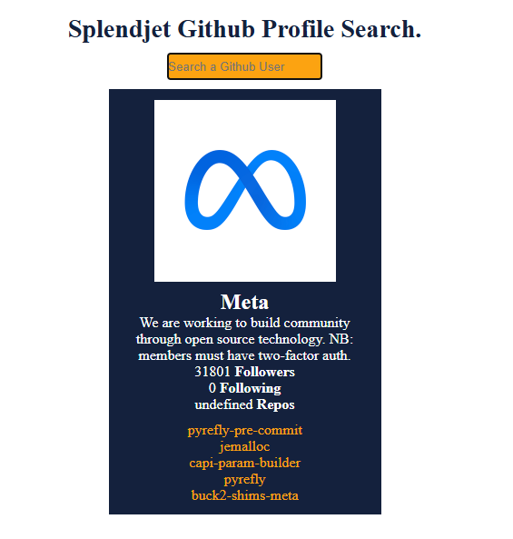

# This project is a gitHub profile seearch app built with Javascript.
    #It fetches user data from the Github API and display the following information on the page;
    #User bio if exists
    #UserName
    #Avatar
    #Followers and following
    #The top 5 repositories on the page

# Skills I learned from this project
    .How to get data from a API key using axios
    .How to catch the errors and update the UI accordingly
    .And how to update the UI top display the correct informations

# What I would do differently if i would redo it again.
    .I will make sure I use Postman to make a first request so i can easyly identify the data I will need to display on the DOM

# Challenges I faced
    #I was struggling to get the data from the API key and update the UI accordingly,
        I have to review some of the previous code or solution to get that done.
    #I was struggling to get the errors and create a separated function to display the  on the DOM.

    #I was struggling to create some HTML element to display the data on the DOM.

With this project i got a little confidence on how to work with API key. Get the data and catch the errors. I also learned the importance of creating multiple functions so i can separate data fetching with DOM manipulation.
Next time I will make sure i do that.

    